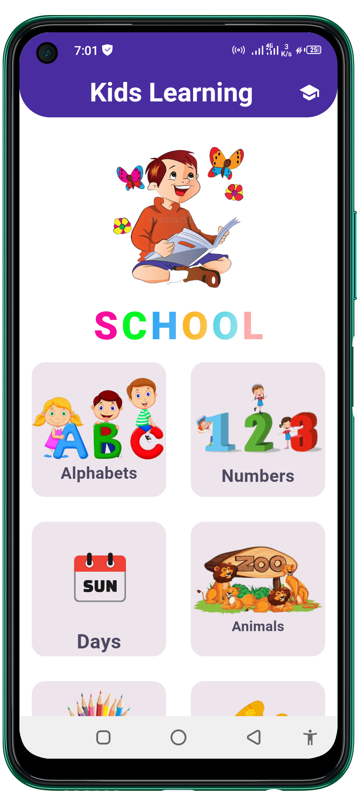

# All_Public_Repository
 In Wich Includes All Publics Projects Repositories
 Bith For ## Application ## And Websites

# 1. Coffee App
 <table style='border:none;width:100%'>
  <td style='width:24%;'>
   
  </td>
  <td style='width:24%;'>
  
  </td>
  <td style='width:24%;'>
  
  </td>
   <td style='width:25%;'>
  
  </td>
</table>

 <table style='border:none;width:100%'>
  <td style='width:24%;'>
   
  </td>
  <td style='width:24%;'>
  
  </td>
  <td style='width:24%;'>
  
  </td>
   <td style='width:25%;'>
  
  </td>
</table>

 <table style='border:none;width:100%'>
  <td style='width:24%;'>
   
  </td>
  <td style='width:24%;'>
  
  </td>
  <td style='width:24%;'>
  
  </td>
   <td style='width:25%;'>
  
  </td>
</table>

# 2. Speech To Text
<table style='border:none;width:100%'>
  <td style='width:24%;'>
   
  </td>
  <td style='width:24%;'>

  
  </td>
   <td style='width:24%;'>

  
  </td>
   </td>
</table>

# 3. Shoes Store
<table style='border:none;width:100%'>
  <td style='width:24%;'>

   
  </td>
  <td style='width:24%;'>

  
  </td>
   <td style='width:24%;'>

  
  </td>
   </td>
   <td style='width:24%;'>

  
  </td>
</table>

# 4. PDF Extra 
<table style='border:none;width:100%'>
  <td style='width:24%;'>
   
  </td>
  <td style='width:24%;'>
  
  </td>
   <td style='width:24%;'>
  
  </td>
</table>

 <table style='border:none;width:100%'>
  <td style='width:24%;'>
   
  </td>
  <td style='width:24%;'>
  
  </td>
  <td style='width:24%;'>
  
  </td>
   <td style='width:25%;'>
  
  </td>
</table>
